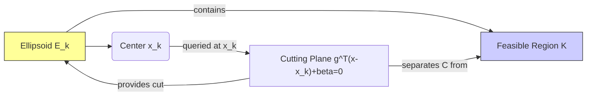

# The Ellipsoid Method and The Amazing Oracles

graph TD
    A[Start] --> B{Decision}
    B -->|Yes| C[Do Something]
    B -->|No| D[Do Something Else]
    C --> E[End]
    D --> E

The ellipsoid method holds a significant place in the history and theory of mathematical optimization. While often perceived as less efficient in practice compared to modern interior-point methods for certain problems, its true power and theoretical importance stem from its ability to handle optimization problems with vast or even infinite numbers of constraints. This capability is unlocked by the method's reliance on "separation oracles" – algorithmic procedures that act as amazing consultants, providing crucial information about the geometry of the feasible region without requiring explicit enumeration of all constraints.

This essay will explore the algorithmic framework, historical context, performance considerations, and, most importantly, the remarkable capabilities enabled by separation oracles across various optimization domains, including robust optimization, network optimization, semidefinite programming, and discrete optimization.

## Algorithmic Framework

The ellipsoid method is a type of cutting plane method used to solve convex feasibility problems. It operates by iteratively shrinking a search space known to contain the feasible region, $\mathcal{K}$. Initially, the method begins with a large ellipsoid that is guaranteed to contain the entire feasible region. This initial ellipsoid is defined by its center $x_c \in \mathbb{R}^n$ and a positive definite matrix $P \in \mathbb{R}^{n \times n}$ that determines its shape and orientation. The ellipsoid can be represented by the set of points $x$ such that $(x - x_c)P^{-1}(x - x_c) \le 1$. An alternative representation splits the matrix $P$ into two parts, $\kappa$ and $Q$, where the ellipsoid is defined as $x$ such that $(x-x_c)Q^{-1}(x-x_c) \le \kappa$.

At the heart of each iteration is the consultation with a **separation oracle**. The oracle is queried at the center of the current ellipsoid, $x_c$. The oracle's task is to either confirm that the center point $x_c$ belongs to the feasible region $\mathcal{K}$ or, if it does not, to provide a *separating hyperplane*. This hyperplane acts as a cut, passing through the ellipsoid and separating the current center $x_c$ from the feasible region $\mathcal{K}$.

A separating hyperplane is defined by a vector $g$ and a scalar $\beta$, such that for all $x \in \mathcal{K}$, $g^\mathsf{T} (x - x_0) + \beta \le 0$, where $x_0$ is the queried point (in this case, $x_c$). This hyperplane effectively eliminates the half-space $\{x \mid g^\mathsf{T} (x - x_0) + \beta > 0\}$ from the search space. The pair $(g, \beta)$ is referred to as a cutting plane. If $\beta=0$, the cut is called a central-cut; if $\beta>0$, it's a deep-cut; and if $\beta<0$, it's a shadow-cut. For a convex set defined by inequalities $f_j(x) \le 0$, the cut can often be expressed as $(\partial f(x_0), f(x_0))$, where $\partial f(x_0)$ is a sub-gradient of a violating function $f$ at $x_0$.

Following the oracle consultation, the ellipsoid is updated. A new, smaller ellipsoid is constructed that is guaranteed to contain the portion of the previous ellipsoid that lies on the side of the separating hyperplane containing the feasible region (the half-ellipsoid created by the cut). The volume of the ellipsoid shrinks by a guaranteed factor, approximately $e^{-1/(2n)}$ at each step, ensuring convergence to the feasible region or indicating that the region is empty. The update equations for the center $x_c$ and the matrix $P$ (or $\kappa$ and $Q$) involve calculations based on the cutting plane provided by the oracle. For a deep-cut with cut parameters $g$ and $\beta$, and given the current ellipsoid center $x_c$ and matrix $P_k$, the next center $x_c^+$ and matrix $P^+$ can be computed using formulas involving $\tilde{g} = P_k g$, $\tau^2 = g^\mathsf{T} P_k g$, $\beta$, and the problem dimension $n$. A split matrix form using $Q$ and $\kappa$ can reduce the computational cost per iteration.

The general cutting plane method, including the ellipsoid method as a specific instance using ellipsoids as the search space, proceeds iteratively. It starts with an initial search space $\mathcal{S}$ containing the feasible region $\mathcal{K}$. In each step, the oracle is queried at a point in $\mathcal{S}$ (typically the center for the ellipsoid method). If the point is in $\mathcal{K}$, the process might terminate (if it's a feasibility problem). Otherwise, the oracle provides a cut, and $\mathcal{S}$ is updated to a smaller set $\mathcal{S}^+$ that contains the intersection of the current $\mathcal{S}$ and the half-space defined by the cut. This repeats until $\mathcal{S}$ is empty or sufficiently small.

Optimization problems, minimize $f_0(x)$ subject to $x \in \mathcal{K}$, can be reformulated as feasibility problems by introducing an auxiliary variable $\gamma$ representing the objective value. The problem becomes finding $x \in \mathcal{K}$ such that $f_0(x) \le \gamma$. This is equivalent to minimizing $\gamma$ subject to $x \in \mathcal{K}_\gamma$, where $\mathcal{K}_\gamma = \{x \mid x \in \mathcal{K}, f_0(x) \le \gamma\}$. The cutting plane method can solve this by performing a binary search on $\gamma$, or by updating the best-so-far value of $\gamma$ whenever a feasible solution $x_c \in \mathcal{K}_\gamma$ is found, specifically by setting $\gamma := f_0(x_c)$. In the optimization context, if the queried center $x_c$ is feasible for the current $\gamma$, the oracle might return a cut related to the objective function to improve the current best $\gamma$.

## Historical Significance

The ellipsoid method's origins trace back to preliminary versions introduced by Naum Z. Shor. Significant contributions were made by Arkadi Nemirovski and David B. Yudin in 1972 with their work on an approximation algorithm for real convex minimization.

However, the method gained widespread prominence with **Leonid Khachiyan's breakthrough work in the late 1970s**. Khachiyan proved that the ellipsoid method could solve linear programming problems in polynomial time. This was a landmark result in computational complexity theory, as it demonstrated that linear programming belongs to the class P – problems solvable in polynomial time. This settled a long-standing theoretical question about the complexity of linear programming. The polynomial complexity of the ellipsoid method for LP depends on the number of variables and the size of the coefficients, but notably, *not* on the number of constraints.

Despite this theoretical achievement, in practice, the simplex method (which has exponential worst-case complexity) often performs much faster than the ellipsoid method for linear programming.

## Performance Considerations

The ellipsoid method possesses significant **theoretical strengths**. It offers polynomial runtime complexity for convex optimization problems under certain assumptions. Its complexity is sometimes described as "R-polynomial," with operations bounded by a polynomial in problem size multiplied by the logarithm of volume factors. The number of steps required is generally on the order of $O(n^2 \log(1/\epsilon))$, where $n$ is the problem dimension and $\epsilon$ is the desired accuracy.

However, the method faces **practical limitations**. Despite its theoretical power, the ellipsoid method is often criticized for its practical performance compared to interior-point methods. A significant bottleneck is that the iteration count grows quadratically with the dimension $n$, which can be prohibitive for high-dimensional problems. Furthermore, the method can be susceptible to numerical instability in practice, which can limit its application, especially for general large-scale convex optimization.

Despite these practical issues, the ellipsoid method remains a valuable tool, particularly in scenarios where its unique strengths, enabled by the separation oracle, come to the fore.

## The Power of Separation Oracles

The true strength and versatility of the ellipsoid method lie in its use of **separation oracles**. As defined earlier, a separation oracle, given a point $x$, either confirms membership in a convex set $\mathcal{K}$ or returns a hyperplane that separates $x$ from $\mathcal{K}$. This approach is powerful because it **does not require explicit enumeration of all constraints** defining the convex set.

This capability allows the ellipsoid method to handle convex sets defined by **enormous or even infinite constraint collections**, as long as an efficient separation oracle exists. This is a key advantage over methods like interior-point methods, which typically require evaluating all constraint functions explicitly.

For the method to be efficient, the oracle consulted at each iteration must be computationally efficient itself and must exploit the specific structure of the optimization problem. This is crucial because the oracle is called repeatedly throughout the algorithmic process.

## Applications Powered by Oracles

The ability to handle infinite or massive constraint sets via efficient separation oracles makes the ellipsoid method particularly well-suited for several complex optimization problems.

### Robust Optimization

**Robust optimization** deals with finding solutions that remain feasible or perform well under uncertainty in problem parameters. Parameters are assumed to belong to defined uncertainty sets. Robust solutions must remain feasible for *all* possible realizations of parameters within these sets. A key challenge in robust optimization is that requiring constraints to hold for all parameter realizations often leads to an infinite number of constraints.

The ellipsoid method is an excellent choice for robust optimization problems because separation oracles can efficiently check for constraint violations across the entire uncertainty set and generate the necessary cutting planes. Instead of enumerating infinite constraints like $f_j(x, q) \le 0$ for all $q$ in an uncertainty set $\mathcal{Q}$, the oracle is queried at a point $x_0$. It needs to determine if $x_0$ satisfies all constraints for all $q \in \mathcal{Q}$. If not, it finds a specific $q_0 \in \mathcal{Q}$ and a constraint $f_j(x_0, q_0) > 0$ that is violated, or if optimizing, finds a $q_0$ where the objective constraint $f_0(x_0, q_0) \ge \gamma$ is violated. The oracle then returns a cutting plane derived from the subgradient of the violated function at $(x_0, q_0)$.

Various uncertainty sets, including polyhedral, ellipsoidal, and interval uncertainty, can be handled. For problems with complex uncertainty structures, techniques like affine arithmetic can potentially be utilized as computational aids within the oracle.

An example is the robust profit maximization problem, reformulated from a Cobb-Douglas production function, where parameters like output elasticities, prices, and constraints are subject to interval uncertainties. Finding the worst-case scenario across these intervals can be complex, but the cutting plane method readily addresses this. While piecewise linear approximations solvable by interior-point methods exist for such problems, they require significant programming effort and yield imprecise solutions; the cutting plane method offers a direct approach by evaluating the constraint or objective at the worst-case parameter values found by the oracle.

### Network and Semidefinite Programming

The ellipsoid method also finds application in **parametric network optimization** and **semidefinite programming (SDP)**.

In **parametric network optimization**, problems involve finding optimal structures or flows in networks where edge weights or other parameters depend on optimization variables. The constraints in such problems often relate to properties of cycles in the network. For instance, constraints might require that no negative cycles exist for certain parameter values. If a negative cycle exists for a given point $x_0$ (representing the parameters), it violates a constraint and can be used to generate a cutting plane. The separation oracle for such problems involves **detecting negative cycles**. Algorithms like Bellman-Ford, Floyd-Warshall, Tarjan's algorithm, or Howard's method for minimum cycle ratio can be used by the oracle to find negative cycles efficiently. If a negative cycle $C_k$ is found for parameters $x_0$, the oracle returns a cut based on the total weight of the cycle $W_k(x_0, \gamma)$ and its subgradient.

An example is finding optimal matrix scalings under the min-max-ratio criterion, which can be transformed into a two-parameter network problem where constraints relate to cycle weights. The function $h_{ij}(x, \gamma)$ defining edge weights depends on the optimization variables, and the oracle needs to check for negative cycles based on these weights.

**Semidefinite programming** (SDP) involves optimizing with symmetric matrix variables subject to constraints that require matrices to be positive semidefinite. A matrix $A$ is positive semidefinite ($A \succeq 0$) if and only if $v^\mathsf{T} A v \ge 0$ for all vectors $v$. This condition $v^\mathsf{T} F(x) v \ge 0$ for all $v$ represents an infinite number of constraints (one for each vector $v$).

The separation oracle for SDP leverages matrix factorization, specifically the **Cholesky decomposition** or **LDLT decomposition**, to check for positive definiteness. These decompositions can efficiently determine if a symmetric matrix is positive definite. The Cholesky decomposition requires the matrix to be positive definite, factoring $A$ into $L L^\mathsf{T}$ where $L$ is lower triangular with positive diagonal entries. The LDLT decomposition is more versatile, applying to symmetric matrices and factoring $A$ into $L D L^\mathsf{T}$ where $D$ is diagonal and $L$ is lower triangular with unit diagonal.

Crucially, these decomposition algorithms can act as separation oracles for positive semidefiniteness constraints. If the decomposition fails (e.g., a non-positive diagonal element is encountered during Cholesky decomposition or the $D_j$ element in LDLT is non-positive), it indicates that the matrix is not positive definite. The decomposition process itself can provide a **witness vector** $v$ that certifies non-positive definiteness, i.e., $v^\mathsf{T} A v < 0$. For a row-based Cholesky decomposition failing at row $p$, a witness vector $v$ can be constructed using the inverse of the leading principal submatrix and a standard basis vector $e_p$. This witness vector $v$ and the value $v^\mathsf{T} F(x_0) v$ form the basis for the cutting plane.

The efficiency of the oracle here comes from **lazy evaluation**. The decomposition can stop as soon as a non-positive diagonal entry is found, providing a witness vector and generating a cut without completing the full decomposition. This allows for constructing cutting planes with minimal effort.

Examples include minimizing the matrix norm, reformulated as an LMI, and estimation of correlation functions for random fields, which can involve minimizing functions subject to positive semidefiniteness constraints on a covariance matrix $\Omega(p)$. The covariance matrix $\Omega(p)$ can be expressed as a linear combination of basis matrices $F_k$, leading to an LMI structure.

### Discrete Optimization

The ellipsoid method can be adapted for problems with **integer or discrete variables**, known as Mixed-Integer Convex Programming (MICP) when the continuous relaxation is convex. Such problems arise in engineering design, like ASIC design, where components must be chosen from a limited library of cell types.

Traditional methods often rely on relaxations and branch-and-bound, which may not fully leverage the convexity or can be computationally expensive. The ellipsoid method can handle discrete problems by adding cutting planes that exclude fractional solutions while preserving integer ones. Since the cutting plane method only requires a separation oracle, it can work for discrete problems. The additional effort for the oracle in this context involves **finding the closest discrete solution** $x_d$ to the current continuous point $x_c$ and generating a cut based on this discrete point. The oracle looks for a nearby discrete solution $x_d$ of $x_c$ and provides a cutting plane separating $x_c$ from the discrete feasible region, of the form $g^\mathsf{T} (x - x_d) + \beta \le 0$.

An example is multiplierless FIR filter design. Designing FIR filters with coefficients constrained to be sums of Signed Power-of-Two (SPT) makes them implementable without general multipliers, reducing hardware cost. This quantization constraint is non-convex. While integer programming or heuristic methods exist, they can be computationally intensive or lack optimality guarantees. The ellipsoid method offers a way to approach such problems by incorporating the discrete nature into the oracle. The oracle, when queried at a continuous point, might round it to a nearby discrete solution and check feasibility or generate a cut based on that discrete point.

## Method Variants and Enhancements

Over time, variants and enhancements to the basic ellipsoid method have been developed.

The **Central-Cut Method** is a special case where the cutting plane always passes through the center of the current ellipsoid ($\beta=0$). The update formulas simplify in this case.

The **Deep-Cut Method** removes more than half of the ellipsoid volume in each step ($\beta>0$). This can potentially accelerate the detection of infeasibility or convergence to the feasible region. The standard update formulas described earlier handle deep cuts.

The **Inscribed Ellipsoid Method** is another variant that finds the largest volume ellipsoid contained within the remaining part of the previous ellipsoid, rather than finding the smallest enclosing one.

Recent improvements include the use of **parallel cuts**. In this variant, the oracle returns *two* cutting planes simultaneously, typically defined by the same normal vector $g$ but with different offsets $\beta_1$ and $\beta_2$, such that $\beta_1 \le g^\mathsf{T} (x - x_c) \le \beta_2$ for all feasible $x$. Parallel cuts can arise from linear inequality constraints with upper and lower bounds, such as $l \le a^\mathsf{T} x + b \le u$. Using two constraints simultaneously can significantly reduce computation time and provide faster convergence, especially when constraints have tight upper and lower bounds. Updating the ellipsoid using parallel cuts involves modified formulas for the center and matrix updates, taking into account both $\beta_1$ and $\beta_2$.

The ellipsoid method's implementation can also be made more efficient. Splitting the matrix $P$ into $\kappa \cdot Q$ can reduce the number of floating point operations per iteration. Furthermore, updates using single cuts or parallel cuts can be implemented to require at most one square root operation.

An example where parallel cuts have been found to markedly reduce runtime is in FIR filter design, particularly when constraints have narrow upper and lower bounds. Designing FIR filters often involves imposing magnitude constraints on the frequency response, $L(\omega) \le |H(\omega)| \le U(\omega)$. When reformulated, these bounds can lead to constraints suitable for parallel cuts.

## Complementary Role in Optimization

Rather than being a direct competitor, the ellipsoid method should be viewed as a **companion to other optimization techniques**, such as interior-point methods. Each method offers distinct advantages depending on the characteristics of the problem at hand.

The **strengths of the ellipsoid method** lie in its ability to efficiently handle problems with massive or infinite constraint sets through the framework of separation oracles. It is particularly valuable for certain problem classes where this structure can be effectively exploited by an oracle, such as robust optimization, parametric problems, and specific types of semidefinite and discrete optimization.

**Interior-point methods**, on the other hand, often exhibit better practical performance for well-structured convex problems where the number of constraints is manageable. They work by traversing the interior of the feasible region, contrasting with the ellipsoid method's approach of shrinking an enclosing volume. Interior-point methods typically require the explicit evaluation of all constraint functions, which makes them less suitable for problems with infinite constraints unless a compact representation exists.

Therefore, the choice between the ellipsoid method and interior-point methods (or other algorithms) depends on the specific problem structure. For problems with complex constraint structures or infinite constraints, the ellipsoid method, powered by an efficient oracle, may be the most effective or even the only viable approach.

## Conclusion: The Enduring Value of Amazing Oracles

The ellipsoid method stands as a cornerstone of modern optimization theory and practice. While its historical significance is cemented by establishing the polynomial-time solvability of linear programming, its enduring value lies in the **elegant framework that leverages separation oracles**.

This separation oracle framework is the key to the method's versatility, enabling the handling of astronomically large or even infinite constraint sets. These "amazing oracles" empower the ellipsoid method to tackle problems that would otherwise remain intractable or require cumbersome explicit enumeration of constraints.

As a complementary tool in the optimization landscape, the ellipsoid method, with its oracle-driven approach, is invaluable for specific problem classes where the underlying structure can be exploited efficiently. By understanding the strengths of the ellipsoid method and the crucial role of its separation oracles, researchers and practitioners gain a powerful capability to address complex optimization challenges across diverse fields, including robust optimization, network analysis, semidefinite programming, and discrete optimization. Its contribution ensures that problems defined by intricate or infinite constraint structures can be brought within the realm of solvable optimization.

***

**Diagram Interpretation Note:** The Mermaid diagram below is an interpretation of the concept depicted by the `tikzpicture` description in source. The source provides coordinates and shapes to represent an ellipsoid, a feasible region, a point inside the ellipsoid, and a cutting plane. This Mermaid diagram attempts to visualize this configuration conceptually, showing an ellipsoid being cut by a line (hyperplane) that separates the center from the feasible region.

*Conceptual diagram illustrating the ellipsoid, feasible region, center, and a cutting plane.*

***

**Equation Translation Note:** Equations from the source materials have been translated into KaTeX format. For example, the ellipsoid definition:
$$\{x \mid (x-x_k) P^{-1}_k (x - x_k) \le 1 \}$$
or the split matrix form:
$$\{ x \mid (x-x_c)Q^{-1}(x-x_c) \le \kappa \}$$
The cutting plane definition:
$$g^\mathsf{T} (x - x_0) + \beta \le 0$$
Updates for deep cut:
$$ x_c^+ = x_c - \frac{\rho}{ \tau^2 } \tilde{g}, \qquad P^+ = \delta\cdot\left(P - \frac{\sigma}{ \tau^2 } \tilde{g}\tilde{g}^\mathsf{T}\right) $$
$$ x_c^+ = x_c - \frac{\rho}{\omega} \tilde{g}, \qquad Q^+ = Q - \frac{\sigma}{\omega} \tilde{g}\tilde{g}^\mathsf{T}, \qquad \kappa^+ = \delta\cdot\kappa $$
Parameters for deep cut:
$$ \rho = \frac{ \tau+n\beta}{n+1}, \qquad \sigma = \frac{2\rho}{ \tau+\beta}, \qquad \delta = \frac{n^2(\tau^2 - \beta^2)}{(n^2 - 1)\tau^2} $$
Parameters for central cut:
$$ \rho = \frac{\tau}{n+1}, \qquad \sigma = \frac{2}{n+1}, \qquad \delta = \frac{n^2}{n^2 - 1} $$
Parallel cut conditions:
$$ g^\mathsf{T} (x - x_c) + \beta_1 \le 0, \quad g^\mathsf{T} (x - x_c) + \beta_2 \ge 0 $$
SDP condition:
$$ v^\mathsf{T} A v \ge 0 $$
LMI definition:
$$A(y) = A_0 + y_1 A_1 + y_2 A_2 + \cdots + y_m A_n \succeq 0$$
Cholesky decomposition:
$$ A = L L^T $$
LDLT decomposition:
$$ \mathbf{A} = \mathbf{LDL}^\mathsf{T} $$
LDLT recursive relations:
$$D_{j} = A_{jj} - \sum_{k=1}^{j-1} L_{jk} L_{jk}^* D_k $$
$$ L_{ij} = \frac{1}{D_j} \left( A_{ij} - \sum_{k=1}^{j-1} L_{ik} L_{jk}^* D_k \right) \quad \text{for } i>j $$
Cut from failing Cholesky:
$$(-v^\mathsf{T} \partial F_{:p,:p}(x_0) v, -v^\mathsf{T} F_{:p,:p}(x_0) v)$$
Matrix norm minimization LMI:
$$ \begin{pmatrix} \gamma I_m & A(x) \\ A^\mathsf{T}(x) & \gamma I_n \end{pmatrix} \succeq 0 $$
Covariance and Correlation definitions:
$$C(\mathbf{s}_i,\mathbf{s}_j) = \mathrm{cov}(Z(\mathbf{s}_i),Z(\mathbf{s}_j)) $$
$$R(\mathbf{s}_i,\mathbf{s}_j)=C(\mathbf{s}_i,\mathbf{s}_j)/ \sqrt{C(\mathbf{s}_i,\mathbf{s}_i)C(\mathbf{s}_j,\mathbf{s}_j)} $$
$$C(h)=\sigma^2 R(h)$$
Covariance matrix form:
$$\Omega(p) = p_1 F_1 + \cdots + p_n F_n$$
Correlation function form:
$$\rho(h) = \sum_i^n p_i \Psi_i(h)$$
Example correlation problem constraints:
$$ \Omega(p) \succcurlyeq 0, \kappa \ge 0 $$
FIR time response:
$$y[t] = \sum_{k=0}^{n-1}{h[k]u[t-k]}$$
FIR frequency response:
$$H(\omega) = \sum_{m=0}^{n-1}{h(m)e^{-jm\omega}}$$
Magnitude constraints:
$$L(\omega) \le |H(\omega)| \le U(\omega)$$
Autocorrelation representation:
$$L^2(\omega) \le R(\omega) \le U^2(\omega)$$
$$R(\omega)=\sum_{i=-n+1}^{n-1}{r(t)e^{-j{\omega}t}}=|H(\omega)|^2$$
Autocorrelation coefficients:
$$ r(t) = \sum_{i=-n+1}^{n-1}{h(i)h(i+t)} $$
Example likelihood estimation problems:
$$ \min_{\kappa, p} \log\det(\Omega(p) + \kappa\cdot I) + \mathrm{Tr}((\Omega(p) + \kappa\cdot I)^{-1}Y) $$
$$ \min_{\kappa, p} \log\det V(p) + \mathrm{Tr}(V(p)^{-1}Y) $$
$$ \Omega(p) + \kappa \cdot I = V(p) \quad 0 \preceq V(p) \preceq 2Y, \kappa {>} 0 $$
Discrete problem cut:
$$ g^\mathsf{T} (x - x_d) + \beta \le 0 $$
